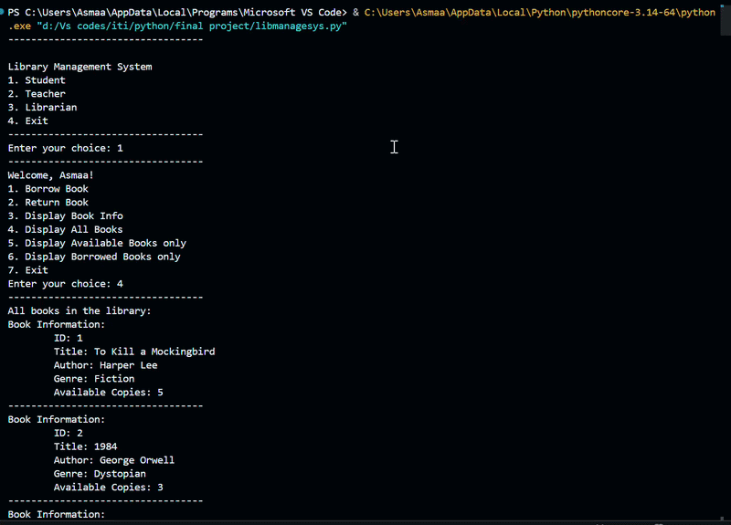

# 📚 Library Management System

A Python console application that demonstrates Core Object-Oriented Programming (OOP) concepts including Abstraction, Inheritance, Encapsulation, and Polymorphism. The system manages library inventory and user interactions based on role permissions.

---

## Features & User Roles

The system supports three user roles, each with different borrowing restrictions and menu permissions:

| Feature / Action | Student | Teacher | Librarian |
| :--- | :---: | :---: | :---: |
| **Borrowing Limit** | Max 3 Books | Max 5 Books | Unlimited |
| **Borrow & Return Books** | ✅ | ✅ | ✅ |
| **Display Book Info** | ✅ | ✅ | ✅ |
| **View All / Available Books** | ✅ | ✅ | ✅ |
| **View Own Borrowed Books** | ✅ | ✅ | ✅ |
| **Add / Remove Books** | ❌ | ❌ | ✅ |
| **Search Book by ID** | ✅ | ✅ | ✅ |

---

##  System Architecture & OOP Implementation

* **`book`**: Enforces encapsulation by keeping `__available_copies` private. Handles inventory mechanics (`borrow_book`, `return_book`, `display_info`).
* **`User` (Abstract Base Class)**: Inherits from `abc.ABC` and defines the core user interface and abstract method `borrow_book(book)`.
* **`Student` & `Teacher` (Derived Classes)**: Implement role-specific borrowing limits (3 for Students, 5 for Teachers).
* **`Librarian` (Derived Class)**: Expands administration capabilities (`add_book`, `remove_book`, `search_book`) without borrowing restrictions.

---

##  Demo & Application Run

